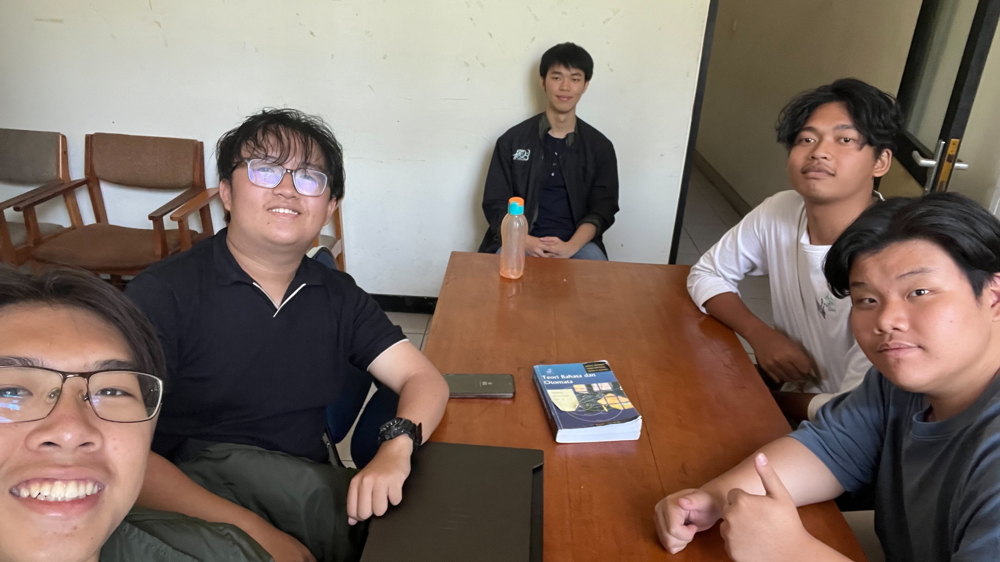

# Form Asistensi

## Tugas Besar IF2150 - Rekayasa Perangkat Lunak

| Informasi | Keterangan |
| --- | --- |
| **Hari** | Selasa |
| **Tanggal** | 15 September 2026 |
| **Kelas** | K01 |
| **Nomor Kelompok** | 7 |
| **Nama Kelompok** | #PenjagaNilai  |
| **Nama Perangkat Lunak** | PahamHukum  |
| **Dokumen** | K01_G07_UC.md |

### Anggota Kelompok

| NIM | Nama |
| --- | --- |
| 13525007 | Rivan Cahyadi |
| 13525019 | Raditya Wibian Sastaka |
| 13525064 | Matthew Evan Kurniawan |
| 13525100 | Wesley Lianto |
| 13525109 | Christopherus Michael Jafeth Tobing |

### Catatan

| Catatan |
| --- |
| 1. Ada tiga tingkatan kebutuhan: goal, task/activity, dan action dimana pada Milestone 3 yang dibuat adalah action.  |
| 2. Saat KF dipetakan menjadi use case, satu use case bisa mencakup beberapa aktivitas atau KF sekaligus untuk dikembangkan. |
| 3. Perbedaan antara activity, KF, dan Use Case adalah activity berfokus pada apa yang ingin dilakukan oleh pengguna, sedangkan KF berfokus pada apa yang harus dilakukan oleh sistem. Use Case menyatukan keduanya menjadi apa yang bisa dilakukan oleh pengguna dalam perangkat lunak beserta feedback dari sistem. Use Case juga lebih merepresentasikan fitur yang bisa dilakukan dan dikembangkan dari kebutuhan fungsional. |
| 4. Perbedaan antara include dan extend untuk Use Case Diagram: include adalah kondisi dimana sebuah use case pasti terlibat dan terhubung dengan use case lainnya (jika Use Case A terjadi, maka Use Case B otomatis akan terjadi juga). Sedangkan, extend dipakai ketika Use Case B belum tentu dijalankan setelah Use Case A (optional), jadi tergantung pada pengguna.|
| 5. Use Case Diagram tidak menunjukkan flow/alur, hanya use case dan hubungannya dengan aktor |

**Notes for this section:**  
*Catatan dapat dituliskan dalam bentuk paragraf atau poin-poin, disesuaikan saja.* 

## Dokumentasi

<!--  -->

  

  <i>Gambar 1. Dokumentasi kegiatan asistensi.</i>

