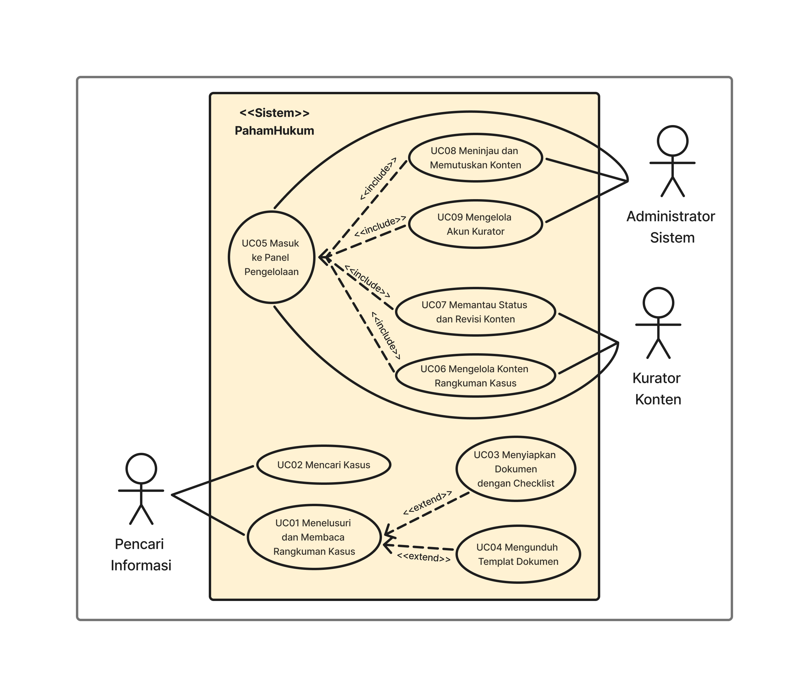
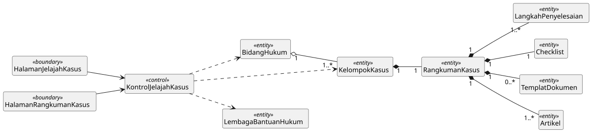
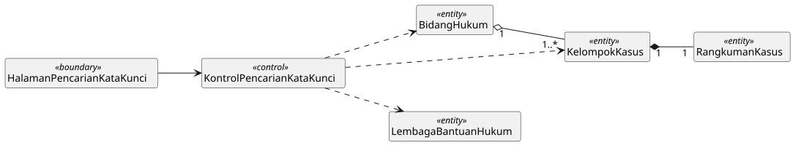
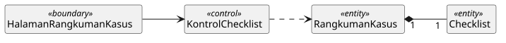
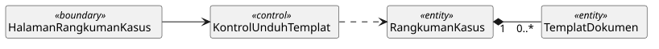
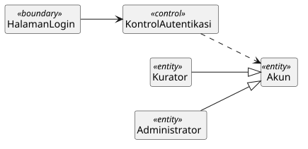
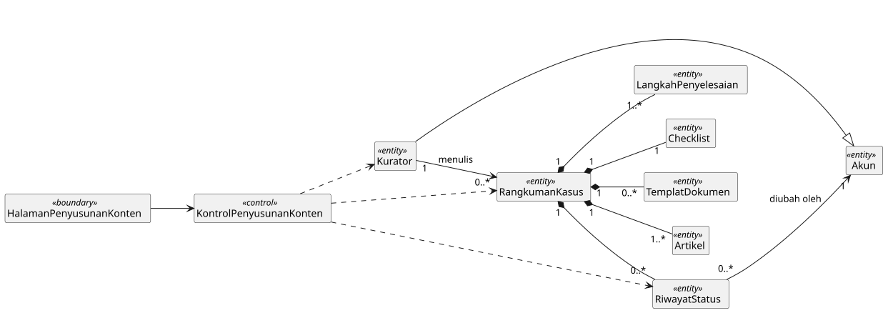
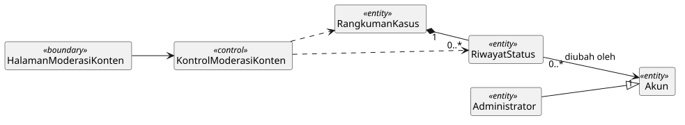
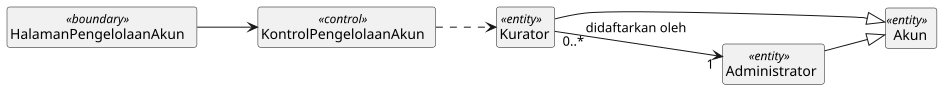
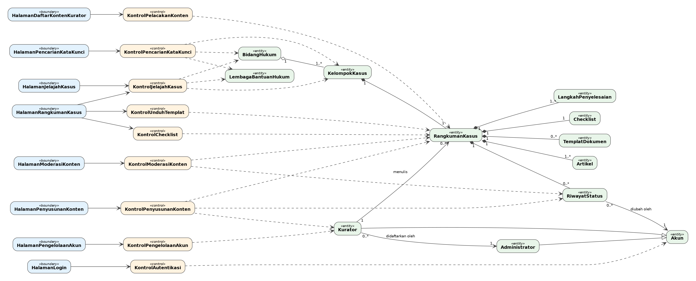

<h1>
IF2150 REKAYASA PERANGKAT LUNAK
 
TUGAS 4
 
CLASS DIAGRAM
</h1>
 

## PahamHukum

### Untuk: Mikhael Andrian Yonatan

Dipersiapkan oleh: #PenjagaNilai
| Informasi | Keterangan |
| --- | --- |
| Kelas | K01 |
| Kelompok | G07  |

| NIM | Nama |
|---|---|
| 13525007 | Rivan Cahyadi |
| 13525019 | Raditya Wibian Sastaka |
| 13525064 | Matthew Evan Kurniawan |
| 13525100 | Wesley Lianto |
| 13525109 | Christopherus Michael Jafeth Tobing |
---

## Daftar Perubahan

| Revisi | Deskripsi |
| :--- | :--- |
| *A* | *Deskripsikan perubahan yang dilakukan dari dokumen sebelumnya pada dokumen ini. Jika tidak terdapat perubahan, harap kosongkan tabel.* |
| *B* |  |
| *C* |  |
| ... |  |

 
 

# BAB 1: Deskripsi Perangkat Lunak

PahamHukum hadir sebagai aplikasi berbasis web yang menjembatani masyarakat awam dengan informasi hukum. Selama ini, informasi hukum seringkali disajikan dengan bahasa yang teknis dan lebih diutamakan bagi kalangan profesional. PahamHukum bertujuan untuk menyelesaikan permasalahan tersebut dengan menyediakan wawasan, panduan untuk menyelesaikan perkara, serta *template* atau *draft* surat yang relevan sebagai dokumen pendukung. Namun, sistem kami tidak menangani perkara secara langsung, tidak mewakili pengguna secara hukum, dan tidak dirancang untuk menggantikan peran advokat atau Lembaga Bantuan Hukum (LBH). Batasan ini diperlukan, mengingat tim kami bukan lembaga bantuan hukum yang berizin atau ahli hukum.

**Ekspektasi Pencari Informasi:** Pengguna ingin mendapatkan kemudahan untuk memahami istilah hukum yang rumit dalam berbagai kasus yang mereka alami. Mereka ingin tahu apakah ada solusi realistis dari perkara tersebut, langkah pertama apa yang harus diambil, serta persiapan apa saja yang diperlukan. Sebelum bertindak lebih lanjut ke lembaga hukum, pengguna ingin mengetahui perkiraan waktu, dokumen yang wajib disiapkan, dan kapan sebaiknya meminta pendampingan profesional di bidang hukum.

**Ekspektasi Kurator Konten:** Kurator butuh kemudahan untuk menuangkan hasil analisisnya ke dalam sistem melalui satu formulir yang terstruktur, tanpa terhambat oleh tampilan *interface* yang membingungkan. Mereka juga ingin agar karyanya dihargai, dimana nama penulis harus tercantum jelas pada setiap konten yang terbit untuk memastikan akuntabilitasnya sebagai referensi atau sumber hukum.

**Ekspektasi Administrator Sistem:** Administrator memerlukan *interface* yang mudah digunakan dan efisien untuk memverifikasi kelayakan konten. Ia ingin membaca isi konten sekaligus memberikan keputusan (menyetujui atau mengembalikan) pada laman yang sama. Tugas utamanya adalah untuk memastikan keaslian dan keakuratan konten yang dibuat dengan kondisi hukum di Indonesia, sehingga fitur tersebut sangat krusial bagi mereka.

Alur kerja aplikasi ini terbagi menjadi dua bagian yang saling berinteraksi. Bagi publik, Pencari Informasi akan membuka halaman utama, menelusuri bidang hukum atau mengetik kata kunci permasalahannya, lalu memilih kasus yang paling cocok. Pada situs web, nama kasus akan ditulis dalam bahasa sehari-hari yang mudah dipahami, misalnya "saya diberhentikan tanpa surat", bukan merujuk pada nomor pasal perundang-undangan. Sistem lalu menampilkan satu halaman berisi inti masalah, hak pengguna, langkah penyelesaian, hal-hal yang perlu dipertimbangkan, daftar dokumen, template surat yang bisa diunduh, artikel atau sumber hukum, dan **disclaimer**. 
Bagi pengelola, Kurator akan masuk ke panel untuk menyusun rangkuman kasus, mengunggah *template*, dan mengajukan *draft* konten. Status konten berubah dari `Draft` menjadi `Diajukan`, lalu masuk ke antrean untuk pengecekan lebih lanjut. Administrator kemudian memeriksa ketepatan informasi hukumnya dan mengambil keputusan. Jika disetujui, konten langsung terbit dengan nama penulis dan tanggal peninjauan. Bila dikembalikan, statusnya menjadi `Perlu Revisi` disertai catatan perbaikan untuk Kurator. Hasil dari kedua bagian inilah yang tayang sebagai halaman rangkuman kasus yang bisa dibaca publik.

Harapan dari *platform* PahamHukum sebenarnya sederhana. Saat menghadapi masalah hukum, seseorang bisa tahu harus melangkah ke mana lebih dulu, alih-alih berhenti pada kebingungan dan berujung diam saja. Produk akhir yang diharapkan adalah situs web berisi direktori kasus dalam bahasa sehari-hari. Setiap kasus akan dilengkapi dengan satu halaman rangkuman yang utuh, mulai dari penjelasan masalah, hak, langkah, hingga *template* surat yang bisa digunakan. Semuanya bersifat gratis, terbuka, dan bersumber dari materi yang sudah terverifikasi dengan penulis yang jelas. Dengan begitu, informasi hukum tidak lagi dianggap menakutkan tetapi bisa dipahami dan ditindaklanjuti orang biasa.

Solusi ini juga berkaitan dengan tujuan pembangunan yang lebih besar. Pada skala global, PahamHukum mendukung Tujuan Pembangunan Berkelanjutan (SDG) nomor 16 mengenai akses keadilan dan informasi yang merata, khususnya Target 16.3 dan 16.10. Ketersediaan regulasi sering kurang bermakna bila masyarakat tidak bisa memahami bahasanya. Pada skala nasional, situs ini bertujuan untuk mendukung visi Indonesia Emas 2045 di bidang supremasi hukum. Menyederhanakan informasi hukum agar mudah dicerna masyarakat umum adalah langkah paling dasar untuk ikut mewujudkan agenda tersebut.

---

# BAB 2: Kebutuhan Fungsional

## 2.1 Kebutuhan Fungsional

Tabel 2.1. Daftar Kebutuhan Fungsional

| ID KF | ID Kebutuhan | Penjelasan |
| :--- | :--- | :--- |
| KF01 | R01 | Sistem harus menampilkan seluruh bidang hukum yang aktif di beranda utama beserta jumlah kelompok kasus pada masing-masing bidang. |
| KF02 | R02, R13 | Selama sebuah konten berstatus selain Disetujui atau kategori hukumnya sedang dinonaktifkan, sistem harus menyembunyikannya dari *interface* publik dan pencarian internal. |
| KF03 | R05 | Ketika Pencari Informasi mengeklik salah satu bidang hukum, sistem harus menampilkan kelompok kasus yang termasuk dalam bidang tersebut. |
| KF04 | R06 | Sistem harus menampilkan judul utama dari kasus dalam bahasa sehari-hari dan menaruh istilah hukum resminya sebagai keterangan pelengkap. |
| KF05 | R07 | Ketika Pencari Informasi memilih sebuah kelompok kasus, sistem harus menampilkan halaman rangkuman untuk kasus tersebut. |
| KF06 | R08 | Ketika Pencari Informasi memasukkan kata kunci pencarian, sistem harus mencocokkannya dengan judul kasus, kalimat gejala, isi rangkuman, dan istilah hukum resmi, lalu menampilkan hasil yang relevan. |
| KF07 | R09 | Jika pencarian tidak menemukan hasil, maka sistem harus menampilkan pesan bahwa kasus belum tersedia, disertai saran bidang hukum lain dan tautan ke lembaga bantuan hukum. |
| KF08 | R11, R12 | Sistem harus menyusun halaman rangkuman kasus dalam satu tampilan berurutan yang meliputi inti masalah, hak, langkah penyelesaian, poin pertimbangan, *checklist* dokumen, templat, artikel pendukung, dan **disclaimer**. |
| KF09 | R46 | Sistem harus menampilkan bagian "hal yang perlu dipertimbangkan" yang berisi perkiraan waktu pengerjaan dan saran kapan pengguna sebaiknya mencari pendampingan profesional. |
| KF10 | R47 | Sistem harus mencantumkan nama Kurator dan tanggal peninjauan oleh Administrator pada setiap rangkuman kasus yang terbit ke publik. |
| KF11 | R14 | Sistem harus menyajikan langkah penyelesaian secara bernomor dan berurutan, lengkap dengan tujuan tiap langkah dan dokumen yang diperlukan pada tahap tersebut. |
| KF12 | R14 | Jika sebuah langkah penyelesaian memiliki tenggat waktu administratif, maka sistem harus menampilkan penanda batas waktu pada langkah tersebut. |
| KF13 | R15 | Ketika Pencari Informasi mencentang sebuah item pada *checklist*, sistem harus memperbarui tampilan item itu dan menghitung berapa banyak dokumen yang sudah disiapkan. |
| KF14 | R16 | Sistem harus menyimpan status *checklist* pada penyimpanan *browser* secara lokal, sehingga *progress* Pencari Informasi tetap terjaga saat halaman dimuat ulang atau dibuka kembali |
| KF15 | R17 | Jika sebuah kasus memiliki berkas templat dokumen, maka sistem harus menampilkan tombol unduh beserta ukuran berkas dan tanggal pembaruan terakhirnya. |
| KF16 | R17 | Ketika Pencari Informasi menekan tombol unduh templat, sistem harus mengirimkan berkas versi terbaru tanpa meminta pengguna mendaftar. |
| KF17 | R18 | Sistem harus menampilkan **disclaimer** bahwa templat hanya berupa kerangka awal, ditempatkan tepat di atas tombol unduh. |
| KF18 | R19 | Sistem harus menampilkan daftar artikel pendukung beserta tautan ke sumber hukum resmi pada bagian akhir halaman rangkuman. |
| KF19 | R21 | Sistem harus menampilkan **disclaimer** pada *footer* di setiap halaman publik yang menegaskan bahwa informasi di PahamHukum bukanlah nasihat hukum resmi |
| KF20 | R22 | Sistem harus menampilkan direktori Lembaga Bantuan Hukum (LBH) terdekat beserta area layanannya. |
| KF21 | R23 | Ketika Pencari Informasi membuka kelompok kasus yang ditandai sebagai situasi darurat, sistem harus menampilkan peringatan prioritas untuk segera melapor ke kepolisian atau unit perlindungan khusus. |
| KF22 | R24 | Sistem harus menyediakan formulir dinamis bagi Kurator yang urutan isiannya mengikuti susunan baku halaman rangkuman pada KF08. |
| KF23 | R25 | Ketika Kurator membuat draf tulisan baru, sistem harus otomatis menetapkan statusnya sebagai *Draft*. |
| KF24 | R26 | Ketika Administrator menyetujui sebuah tulisan, sistem harus menayangkannya ke *interface* publik tanpa perlu *deploy* ulang aplikasi. |
| KF25 | R27 | Ketika Kurator mengunggah berkas templat ke sebuah kasus, sistem harus menyimpan berkas itu dan mencatat tanggal pembaruannya sebagai versi terbaru. |
| KF26 | R28 | Jika berkas templat yang diunggah bukan PDF atau DOCX, atau melebihi 5 MB, maka sistem harus menolak unggahan dan menampilkan pesan penjelasan yang benar. |
| KF27 | R30 | Ketika Kurator mengajukan sebuah tulisan, sistem harus mengubah statusnya dari *Draft* menjadi *Diajukan* dan memasukkannya ke antrean peninjauan Administrator. |
| KF28 | R31 | Jika Kurator mengajukan tulisan sementara masih ada isian wajib yang kosong, maka sistem harus mencegah pengajuan dan menandai isian mana saja yang belum lengkap. |
| KF29 | R32 | Sistem harus menampilkan daftar tulisan milik tiap Kurator beserta statusnya (*Draft*, *Diajukan*, *Disetujui*, atau *Perlu Revisi*). |
| KF30 | R32 | Jika sebuah tulisan ditetapkan sebagai *Perlu Revisi*, maka sistem harus menampilkan catatan perbaikan dari Administrator pada menu penyuntingan Kurator terkait. |
| KF31 | R33 | Sistem harus menampilkan antrean tulisan berstatus *Diajukan* bagi Administrator, diurutkan dari yang paling lama menunggu, beserta nama pengunggahnya. |
| KF32 | R34 | Ketika Administrator memilih Setujui, sistem harus mengubah status tulisan menjadi "Disetujui". |
| KF33 | R34 | Ketika Administrator memilih Kembalikan, sistem harus mengubah status tulisan menjadi "Perlu Revisi" dan mengirimkan catatan revisi dari Administrator kepada Kurator. |
| KF34 | R35 | Jika Administrator mengembalikan tulisan tetapi kolom alasan revisi dibiarkan kosong, sistem harus menahan perubahan status dan mewajibkan alasan revisi diisi lebih dulu. |
| KF35 | R36 | Jika seorang Kurator mencoba menayangkan sendiri tulisannya, maka sistem harus menolak permintaan tersebut. |
| KF36 | R37 | Ketika status sebuah konten berubah, sistem harus mencatat riwayatnya secara lengkap, memuat nama pengubah, waktu, dan status barunya. |
| KF37 | R38 | Ketika Administrator menonaktifkan akun seorang Kurator, sistem harus segera memutus sesinya jika sedang login dan mencegahnya login kembali. |
| KF38 | R39 | Sistem harus menyediakan pendaftaran akun hanya melalui panel Administrator, dan tidak menyediakan menu *Sign Up* di *interface* publik. |
| KF39 | R40 | Ketika Administrator atau Kurator memasukkan email dan kata sandi yang benar, sistem harus memberi akses dan mengarahkan mereka ke *interface* sesuai perannya. |
| KF40 | R40 | Jika email atau kata sandi yang dimasukkan salah, maka sistem harus menolak akses dengan pesan *error* tanpa menyebutkan bagian mana yang keliru. |
| KF41 | R42 | Jika ada upaya membuka halaman pengelola tanpa sesi login yang sah, maka sistem harus mengalihkannya ke halaman login atau menampilkan halaman akses ditolak. |
| KF42 | R45 | Sistem harus menggunakan Bahasa Indonesia yang sopan dan formal secara konsisten pada label tombol, pesan kesalahan, dan isi *interface*. |
| KF43 | R38 | Ketika Administrator menyimpan perubahan data akun Kurator, sistem harus memperbarui detail akun tersebut dan memberlakukannya pada sesi login Kurator berikutnya. |

---

# BAB 3: Model Use Case

## 3.1 Identifikasi Aktor

| Aktor | Deskripsi |
| :--- | :--- |
| **Pencari Informasi (Masyarakat Awam)** | Masyarakat umum yang sedang menghadapi persoalan hukum, atau sekadar ingin memahaminya, misalnya sengketa ketenagakerjaan dan perselisihan transaksi. Kebanyakan tidak berlatar hukum dan kurang familier dengan istilah teknis maupun nomor peraturan. Yang mereka butuhkan kejelasan, bahasa yang sederhana, dan panduan langkah yang praktis. Umumnya, situs diakses lewat perangkat seluler dengan kualitas koneksi yang bervariasi, dan mereka memakai sistem tanpa perlu mendaftar dan membuat akun. |
| **Kurator Konten** | Tim pengelola yang menyusun kategori hukum, menulis rangkuman kasus, mengunggah materi pendukung, dan menyiapkan *template* dokumen. Mereka memiliki pemahaman dasar tentang hukum, teliti saat merujuk peraturan, serta konsisten menjaga informasi tetap mudah dicerna orang awam. Kurator bekerja melalui panel pengelolaan dan tidak berwenang menerbitkan konten langsung ke publik. |
| **Administrator Sistem** | Pemegang otoritas tertinggi dalam sistem. Tugas utamanya meninjau akurasi konten dari Kurator sebelum terbit, sekaligus mengelola akun dan hak akses mereka. Pemahaman hukumnya umumnya lebih dalam daripada Kurator dengan tingkat kehati-hatian yang tinggi untuk meloloskan informasi hukum bagi konsumsi publik, contohnya praktisi hukum atau mahasiswa tingkat akhir di bidang hukum.|

## 3.2 Identifikasi Use Case

Use case berfungsi untuk mendeskripsikan interaksi aktor-aktor yang terlibat dengan sistem. Isi daftar use case dan deskripsi singkatnya dalam tabel di bawah.

Pada bagian ini, Anda diperbolehkan untuk menyalin dari dokumen sebelumnya.

| ID UC | Nama Use Case | Deskripsi Singkat | Aktor | ID KF |
| :--- | :--- | :--- | :--- | :--- |
| UC01 | Menelusuri dan Membaca Rangkuman Kasus | Pencari Informasi menelusuri bidang dan kelompok hukum, lalu membuka satu halaman rangkuman kasus yang memuat inti masalah, hak, langkah, pertimbangan, dan referensi. | Pencari Informasi | KF01, KF02, KF03, KF04, KF05, KF08, KF09, KF10, KF11, KF12, KF18, KF19, KF20, KF21, KF42 |
| UC02 | Mencari Kasus | Pencari Informasi mengetik kata kunci untuk langsung menuju kasus yang dicari tanpa menelusuri seluruh kategori. | Pencari Informasi | KF02, KF06, KF07 |
| UC03 | Menyiapkan Dokumen dengan *Checklist* | Pencari Informasi menandai dokumen yang sudah disiapkan pada *checklist*, dan progresnya tersimpan di *browser* sehingga tetap terjaga saat halaman dibuka kembali. | Pencari Informasi | KF13, KF14 |
| UC04 | Mengunduh Templat Dokumen | Pencari Informasi mengunduh templat surat yang tersedia pada sebuah kasus sebagai kerangka awal dokumen. | Pencari Informasi | KF15, KF16, KF17 |
| UC05 | Masuk ke Panel Pengelolaan | Kurator atau Administrator masuk ke panel pengelolaan menggunakan email dan kata sandinya. | Kurator Konten, Administrator Sistem | KF39, KF40, KF41 |
| UC06 | Mengelola Konten Rangkuman Kasus | Kurator menulis, menyunting, melampirkan templat, lalu mengajukan konten rangkuman kasus untuk ditinjau. | Kurator Konten | KF22, KF23, KF25, KF26, KF27, KF28, KF35 |
| UC07 | Memantau Status dan Revisi Konten | Kurator memantau status pengajuan kontennya dan membaca catatan revisi bila ada. | Kurator Konten | KF29, KF30 |
| UC08 | Meninjau dan Memutuskan Konten | Administrator meninjau konten yang diajukan Kurator, lalu menyetujui atau mengembalikannya disertai catatan. | Administrator Sistem | KF24, KF31, KF32, KF33, KF34, KF36 |
| UC09 | Mengelola Akun Kurator | Administrator mendaftarkan, memperbarui, atau menonaktifkan akun Kurator beserta hak aksesnya. | Administrator Sistem | KF37, KF38, KF43 |

## 3.3 Use Case Diagram
Buatlah diagram use case keseluruhan berdasarkan identifikasi use case beserta aktor yang melakukan use case tersebut. Perhatikan garis `<<extend>>` dan `<<include>>`.

 

<i>Gambar 1. Use Case Diagram</i>

 

## 3.4 Skenario Use Case
Salin ulang skenario **setiap** use case (skenario normal dan alternatif) dari dokumen *Use Case & Scenario Use Case*. Skenario ini menjadi dasar penentuan atribut dan metode/operasi kelas pada BAB 4.

### 3.4.1 Skenario UC01

**Nama Use Case:** Menelusuri dan Membaca Rangkuman Kasus

**Skenario Normal**

| No | Aksi Aktor | Reaksi Perangkat Lunak |
| :--- | :--- | :--- |
| 1 | Pencari Informasi membuka halaman beranda | Sistem menampilkan seluruh bidang hukum aktif beserta jumlah kelompok kasus pada masing-masing bidang, dan hanya menampilkan konten yang sudah berstatus Disetujui |
| 2 | Pencari Informasi memilih salah satu bidang hukum | Sistem menampilkan kelompok kasus pada bidang tersebut, dengan judul dalam bahasa sehari-hari dan istilah hukum resmi sebagai keterangan pelengkap |
| 3 | Pencari Informasi memilih kelompok kasus yang sesuai | Sistem membuka halaman rangkuman kasus yang tersusun berurutan, meliputi inti masalah, hak, langkah penyelesaian, poin pertimbangan, checklist dokumen, templat, artikel pendukung, dan **disclaimer** |
| 4 | Pencari Informasi membaca bagian hak dan pertimbangan | Sistem menampilkan hak pengguna serta bagian "hal yang perlu dipertimbangkan" yang memuat perkiraan waktu pengerjaan dan saran kapan sebaiknya mencari pendampingan profesional |
| 5 | Pencari Informasi membaca langkah penyelesaian | Sistem menyajikan langkah secara bernomor dan berurutan, lengkap dengan tujuan tiap langkah dan dokumen yang diperlukan, serta menandai langkah yang memiliki tenggat waktu |
| 6 | Pencari Informasi menelusuri bagian akhir halaman | Sistem menampilkan artikel pendukung bertaut ke sumber hukum resmi, direktori Lembaga Bantuan Hukum terdekat, nama Kurator dan tanggal peninjauan, serta **disclaimer** pada footer |

 

**Skenario Alternatif 1: Kasus Ditandai Situasi Darurat**

| No | Aksi Aktor | Reaksi Perangkat Lunak |
| :--- | :--- | :--- |
| 1 | Pencari Informasi memilih kelompok kasus yang ditandai sebagai situasi darurat | Sistem menampilkan peringatan prioritas agar segera melapor ke kepolisian atau unit perlindungan khusus |
| 2 | Pencari Informasi menutup peringatan dan melanjutkan | Sistem menampilkan halaman rangkuman kasus seperti pada skenario normal |

### 3.4.2 Skenario UC02

**Nama Use Case:** Mencari Kasus

**Skenario Normal**

| No | Aksi Aktor | Reaksi Perangkat Lunak |
| :--- | :--- | :--- |
| 1 | Pencari Informasi mengetik kata kunci pada kolom pencarian | Sistem mencocokkan kata kunci dengan judul kasus, kalimat gejala, isi rangkuman, dan istilah hukum resmi |
| 2 | Pencari Informasi mengirim pencarian | Sistem menampilkan daftar kasus yang relevan, terbatas pada konten yang sudah Disetujui |
| 3 | Pencari Informasi memilih salah satu hasil | Sistem membuka halaman rangkuman kasus terkait |

 

**Skenario Alternatif 1: Pencarian Tidak Menemukan Hasil**

| No | Aksi Aktor | Reaksi Perangkat Lunak |
| :--- | :--- | :--- |
| 1 | Pencari Informasi mengirim kata kunci yang tidak cocok dengan kasus mana pun | Sistem menampilkan pesan yang sopan bahwa kasus belum tersedia, disertai saran bidang hukum lain dan tautan lembaga bantuan hukum |

### 3.4.3 Skenario UC03

**Nama Use Case:** Menyiapkan Dokumen dengan *Checklist*

**Skenario Normal**

| No | Aksi Aktor | Reaksi Perangkat Lunak |
| :--- | :--- | :--- |
| 1 | Pencari Informasi membuka bagian *checklist* dokumen pada halaman rangkuman | Sistem menampilkan daftar dokumen yang perlu disiapkan |
| 2 | Pencari Informasi mencentang dokumen yang sudah disiapkan | Sistem memperbarui tampilan item yang dicentang, menghitung berapa banyak dokumen yang sudah siap, dan menyimpan status centang ke penyimpanan lokal peramban |
| 3 | Pencari Informasi meninggalkan halaman | Sistem mempertahankan status centang di penyimpanan lokal peramban pengguna tanpa mengirimnya ke server |

 

**Skenario Alternatif 1: Pengguna Memuat Ulang atau Membuka Kembali Halaman**

| No | Aksi Aktor | Reaksi Perangkat Lunak |
| :--- | :--- | :--- |
| 1 | Pencari Informasi memuat ulang atau membuka kembali halaman rangkuman yang sama | Sistem memulihkan status *checklist* dan centangnya dari penyimpanan lokal peramban, sehingga progres sebelumnya tetap terjaga |

### 3.4.4 Skenario UC04

**Nama Use Case:** Mengunduh Templat Dokumen

**Skenario Normal**

| No | Aksi Aktor | Reaksi Perangkat Lunak |
| :--- | :--- | :--- |
| 1 | Pencari Informasi mencari bagian templat pada halaman rangkuman | Sistem menampilkan tombol unduh beserta ukuran berkas dan tanggal pembaruan terakhir, serta *disclaimer* bahwa templat hanya kerangka awal tepat di atas tombol |
| 2 | Pencari Informasi menekan tombol unduh | Sistem mengirimkan berkas templat versi terbaru tanpa meminta pengguna mendaftar |

 

**Skenario Alternatif 1: Kasus Belum Memiliki Templat**

| No | Aksi Aktor | Reaksi Perangkat Lunak |
| :--- | :--- | :--- |
| 1 | Pencari Informasi membuka kasus yang belum memiliki berkas templat | Sistem tidak menampilkan tombol unduh dan menyatakan bahwa templat belum tersedia untuk kasus tersebut |

### 3.4.5 Skenario UC05

**Nama Use Case:** Masuk ke Panel Pengelolaan

**Skenario Normal**

| No | Aksi Aktor | Reaksi Perangkat Lunak |
| :--- | :--- | :--- |
| 1 | Kurator atau Administrator membuka halaman login dan memasukkan email dan kata sandi yang benar | Sistem memberi akses dan mengarahkan pengguna ke antarmuka kerja sesuai perannya |

 

**Skenario Alternatif 1: Kredensial Salah**

| No | Aksi Aktor | Reaksi Perangkat Lunak |
| :--- | :--- | :--- |
| 1 | Pengguna memasukkan email atau kata sandi yang keliru | Sistem menolak akses dan menampilkan pesan galat tanpa menyebutkan bagian mana yang salah |

 

**Skenario Alternatif 2: Akses Tanpa Sesi yang Sah**

| No | Aksi Aktor | Reaksi Perangkat Lunak |
| :--- | :--- | :--- |
| 1 | Pengguna mencoba membuka halaman pengelola tanpa sesi login yang sah | Sistem mengalihkannya ke halaman login atau menampilkan halaman akses ditolak |

### 3.4.6 Skenario UC06

**Nama Use Case:** Mengelola Konten Rangkuman Kasus

**Skenario Normal**

| No | Aksi Aktor | Reaksi Perangkat Lunak |
| :--- | :--- | :--- |
| 1 | Kurator membuka formulir penyusunan konten | Sistem menampilkan formulir dinamis yang urutan isiannya mengikuti susunan baku halaman rangkuman |
| 2 | Kurator mulai menulis draf baru | Sistem menetapkan status konten sebagai Draft secara otomatis |
| 3 | Kurator melampirkan berkas templat pada kasus | Sistem menyimpan berkas dan memperbarui riwayat perubahan dokumen sebagai versi paling baru |
| 4 | Kurator melengkapi seluruh isian wajib lalu mengajukan konten | Sistem mengubah status dari Draft menjadi Diajukan dan memasukkannya ke antrean peninjauan Administrator |

 

**Skenario Alternatif 1: Berkas Templat Tidak Valid**

| No | Aksi Aktor | Reaksi Perangkat Lunak |
| :--- | :--- | :--- |
| 1 | Kurator mengunggah berkas templat selain PDF atau DOCX, atau berukuran melebihi 5 MB | Sistem menolak unggahan dan menampilkan pesan yang menjelaskan format dan ukuran yang benar |

 

**Skenario Alternatif 2: Isian Wajib Belum Lengkap**

| No | Aksi Aktor | Reaksi Perangkat Lunak |
| :--- | :--- | :--- |
| 1 | Kurator mengajukan konten sementara masih ada isian wajib yang kosong | Sistem mencegah pengajuan dan menandai isian mana saja yang belum lengkap |

 

**Skenario Alternatif 3: Kurator Mencoba Menayangkan Sendiri**

| No | Aksi Aktor | Reaksi Perangkat Lunak |
| :--- | :--- | :--- |
| 1 | Kurator mencoba menayangkan langsung kontennya ke publik | Sistem menolak permintaan tersebut, karena penayangan hanya dapat dilakukan melalui persetujuan Administrator |

### 3.4.7 Skenario UC07

**Nama Use Case:** Memantau Status dan Revisi Konten

**Skenario Normal**

| No | Aksi Aktor | Reaksi Perangkat Lunak |
| :--- | :--- | :--- |
| 1 | Kurator membuka daftar kontennya | Sistem menampilkan seluruh tulisan milik Kurator beserta statusnya, yaitu Draft, Diajukan, Disetujui, atau Perlu Revisi |

 

**Skenario Alternatif 1: Konten Berstatus Perlu Revisi**

| No | Aksi Aktor | Reaksi Perangkat Lunak |
| :--- | :--- | :--- |
| 1 | Kurator membuka konten yang berstatus Perlu Revisi | Sistem menampilkan catatan perbaikan dari Administrator pada menu penyuntingan konten terkait |

### 3.4.8 Skenario UC08

**Nama Use Case:** Meninjau dan Memutuskan Konten

**Skenario Normal**

| No | Aksi Aktor | Reaksi Perangkat Lunak |
| :--- | :--- | :--- |
| 1 | Administrator membuka antrean peninjauan | Sistem menampilkan daftar konten berstatus Diajukan, diurutkan dari yang paling lama menunggu beserta nama pengunggahnya |
| 2 | Administrator membuka salah satu konten dan meninjau isinya | Sistem menampilkan isi konten pada layar peninjauan |
| 3 | Administrator memilih Setujui | Sistem mengubah status menjadi Disetujui, menayangkan konten ke publik, dan mencatat riwayat perubahan status |

 

**Skenario Alternatif 1: Konten Dikembalikan dengan Catatan Revisi**

| No | Aksi Aktor | Reaksi Perangkat Lunak |
| :--- | :--- | :--- |
| 1 | Administrator memilih Kembalikan dan mengisi alasan revisi | Sistem mengubah status menjadi Perlu Revisi, mengirimkan catatan revisi kepada Kurator, dan mencatat riwayat perubahan status |

 

**Skenario Alternatif 2: Alasan Revisi Dikosongkan**

| No | Aksi Aktor | Reaksi Perangkat Lunak |
| :--- | :--- | :--- |
| 1 | Administrator memilih Kembalikan tetapi membiarkan kolom alasan revisi kosong | Sistem menahan perubahan status dan mewajibkan alasan revisi diisi lebih dulu |

### 3.4.9 Skenario UC09

**Nama Use Case:** Mengelola Akun Kurator

**Skenario Normal**

| No | Aksi Aktor | Reaksi Perangkat Lunak |
| :--- | :--- | :--- |
| 1 | Administrator membuka panel pengelolaan akun dan mendaftarkan akun Kurator baru | Sistem membuat akun tersebut melalui panel Administrator, tanpa membuka pendaftaran mandiri di *interface* publik |
| 2 | Administrator memperbarui detail akun Kurator | Sistem menyimpan perubahan dan memberlakukannya pada sesi login Kurator berikutnya |

 

**Skenario Alternatif 1: Penonaktifan Akun Kurator**

| No | Aksi Aktor | Reaksi Perangkat Lunak |
| :--- | :--- | :--- |
| 1 | Administrator menonaktifkan akun seorang Kurator | Sistem segera memutus sesi Kurator tersebut bila sedang login dan mencegahnya login kembali |

---

# BAB 4: Diagram Kelas
Bagian ini berisi identifikasi kelas dan pemodelan struktur kelas yang diperlukan untuk merealisasikan use case pada BAB 3. Gunakan skenario use case (3.4) sebagai dasar untuk menentukan kelas, atribut, metode, dan hubungan antarkelas.

## 4.1 Identifikasi Kelas
Identifikasi seluruh kelas yang diperlukan berdasarkan use case dan skenarionya. Satu kelas boleh terkait dengan lebih dari satu use case.

| ID Kelas | Nama Kelas | Deskripsi Kelas | ID Use Case |
| :--- | :--- | :--- | :--- |
| C01 | Akun | Berisi data akun pengelola (email, kata sandi, peran, dan status) yang digunakan dalam sistem, menjadi induk dari Kurator dan Administrator | UC05, UC09 |
| C02 | Kurator | Salah satu pengelola yang menyusun dan mengajukan konten, turunan dari Akun | UC05, UC06, UC07, UC09 |
| C03 | Administrator | Salah satu pengelola yang meninjau konten yang berbasis hukum dan mengelola akun Kurator, turunan dari Akun | UC05, UC08, UC09 |
| C04 | BidangHukum | Kategori hukum lebih umum yang menaungi beberapa kelompok kasus yang lebih rinci sesuai peristiwa | UC01, UC02 |
| C05 | KelompokKasus | Satu jenis kasus dengan judul umum yang mudah dimengerti dan *disclaimer* jika kasus termasuk kelompok "darurat", menaungi satu rangkuman | UC01, UC02 |
| C06 | RangkumanKasus | Halaman konten inti sebuah kasus yang menyimpan inti masalah, hak pelapor, poin pertimbangan, alur dan *timeline* pelaporan, langkah penyelesaian, *checklist* dokumen, templat, dan artikel pendukung menjadi satu kesatuan. Dicantumkan juga nama penulis dan tanggal peninjauan terkini | UC01, UC02, UC03, UC04, UC06, UC07, UC08 |
| C07 | LangkahPenyelesaian | Langkah bernomor pada rangkuman kasus yang memuat tujuan, dokumen yang diperlukan, dan tenggat waktu untuk pelaporan | UC01, UC06 |
| C08 | *Checklist* | Daftar dokumen yang perlu disiapkan untuk sebuah kasus yang ditulis oleh Kurator sebagai bagian dari konten | UC01, UC03, UC06 |
| C09 | TemplatDokumen | Berkas surat berupa templat yang dapat diunduh, disertai informasi mengenai format, ukuran *file*, versi, dan tanggal pembaruan | UC01, UC04, UC06 |
| C10 | Artikel | Artikel pendukung beserta tautan ke sumber hukum resmi pada rangkuman | UC01, UC06 |
| C11 | LembagaBantuanHukum | Direktori LBH beserta area layanannya | UC01, UC02 |
| C12 | RiwayatStatus | Menyimpan riwayat status konten setiap kali terjadi perubahan, yang dicatat adalah konten yang berubah, siapa yang mengubah, kapan, dan statusnya | UC06, UC08 |
| C13 | HalamanJelajahKasus | Layar beranda tempat Pencari Informasi menelusuri bidang hukum lalu memilih kelompok kasus | UC01 |
| C14 | HalamanRangkumanKasus | Layar yang menampilkan isi lengkap satu rangkuman kasus termasuk langkah, *checklist*, templat, artikel, dan direktori LBH. | UC01, UC03, UC04 |
| C15 | HalamanPencarianKataKunci | Layar berisi kolom pencarian dan daftar hasil pencocokan kata kunci | UC02 |
| C16 | HalamanLogin | Layar untuk *log in* bagi Kurator dan Administrator | UC05 |
| C17 | HalamanPenyusunanKonten | Semacam formulir tempat Kurator menyusun, menyunting, melampirkan templat dokumen, dan mengajukan konten | UC06 |
| C18 | HalamanDaftarKontenKurator | Layar berisi daftar konten milik Kurator beserta status dan catatan revisinya | UC07 |
| C19 | HalamanModerasiKonten | Layar antrean dan peninjauan konten untuk Administrator | UC08 |
| C20 | HalamanPengelolaanAkun | Panel Administrator untuk mendaftarkan, memperbarui, dan menonaktifkan akun Kurator | UC09 |
| C21 | KontrolJelajahKasus | Mengatur alur menampilkan bidang hukum, kelompok, dan rangkuman kasus | UC01 |
| C22 | KontrolPencarianKataKunci | Memproses kata kunci, mengambil hasil yang relevan, dan menyarankan alternatif jika tidak ditemukan kasusnya | UC02 |
| C23 | KontrolChecklist | Mengambil *checklist* dan menghitung kelengkapan dokumen yang dicentang | UC03 |
| C24 | KontrolUnduhTemplat | Menyediakan berkas templat versi terbaru untuk diunduh | UC04 |
| C25 | KontrolAutentikasi | Memeriksa kredensial akun dan mengarahkan pengguna ke antarmuka sesuai perannya | UC05 |
| C26 | KontrolPenyusunanKonten | Mengatur pembuatan draf, pelampiran templat, validasi isian, dan pengajuan konten oleh Kurator untuk mengubah status konten (Draf -> Diajukan) | UC06 |
| C27 | KontrolPelacakanKonten | Mengambil daftar konten milik Kurator dan catatan revisinya | UC07 |
| C28 | KontrolModerasiKonten | Mengatur persetujuan dan pengembalian konten dari Administrator sekaligus pencatatan riwayat status ke entity RiwayatStatus | UC08 |
| C29 | KontrolPengelolaanAkun | Mengatur pendaftaran, pembaruan, dan penonaktifan akun Kurator | UC09 |

Pastikan setiap kelas memiliki tanggung jawab yang jelas dan memang diperlukan untuk merealisasikan fungsi yang dimodelkan. Hindari kelas yang tidak memiliki keterkaitan dengan KF atau use case manapun.

## 4.2 Diagram Kelas per Use Case
Buat diagram kelas untuk setiap use case pada 3.2.

### 4.2.1 Use Case UC01

**Nama Use Case:** Menelusuri dan Membaca Rangkuman Kasus

#### Identifikasi Kelas

| ID Kelas | Nama Kelas | Deskripsi Kelas |
| :--- | :--- | :--- |
| C13 | HalamanJelajahKasus | Layar beranda tempat Pencari Informasi menelusuri bidang hukum lalu memilih kelompok kasus |
| C14 | HalamanRangkumanKasus | Layar yang menampilkan isi lengkap satu rangkuman kasus termasuk langkah, *checklist*, templat, artikel, dan direktori LBH |
| C21 | KontrolJelajahKasus | Mengatur alur menampilkan bidang hukum, kelompok, dan rangkuman kasus |
| C04 | BidangHukum | Kategori hukum lebih umum yang menaungi beberapa kelompok kasus yang lebih rinci sesuai peristiwa |
| C05 | KelompokKasus | Satu jenis kasus dengan judul umum yang mudah dimengerti dan *disclaimer* jika kasus termasuk kelompok "darurat", menaungi satu rangkuman |
| C06 | RangkumanKasus | Halaman konten inti sebuah kasus yang menyimpan inti masalah, hak pelapor, poin pertimbangan, langkah penyelesaian, *checklist* dokumen, templat, dan artikel pendukung menjadi satu kesatuan, beserta nama penulis dan tanggal peninjauan terkini |
| C07 | LangkahPenyelesaian | Langkah bernomor pada rangkuman kasus yang memuat tujuan, dokumen yang diperlukan, dan tenggat waktu untuk pelaporan |
| C08 | *Checklist* | Daftar dokumen yang perlu disiapkan untuk sebuah kasus yang ditulis oleh Kurator sebagai bagian dari konten |
| C09 | TemplatDokumen | Berkas surat berupa templat yang dapat diunduh, disertai informasi mengenai format, ukuran *file*, versi, dan tanggal pembaruan |
| C10 | Artikel | Artikel pendukung beserta tautan ke sumber hukum resmi pada rangkuman |
| C11 | LembagaBantuanHukum | Direktori LBH beserta wilayah layanannya, dicari berdasarkan wilayah yang dipilih pengguna |

#### Diagram Kelas

<i>Gambar 2. Diagram Kelas Use Case UC01</i>

 

| ID Kelas | Nama Kelas | Atribut | Metode/Operasi |
| :--- | :--- | :--- | :--- |
| C13 | HalamanJelajahKasus | - sectionDaftarBidang: Section - kartuBidangHukum: Card [1..\*] - sectionDaftarKelompok: Section - kartuKelompokKasus: Card [1..\*] - popupPeringatanDarurat: Modal - tombolTutupPeringatan: Button | + tampilkanHalaman(): void + klikBidangHukum(idBidang: int): void + klikKelompokKasus(idKelompok: int): void + tutupPeringatan(): void |
| C14 | HalamanRangkumanKasus | - sectionIntiMasalah: Section - sectionHak: Section - sectionPertimbangan: Section - sectionLangkah: Section - penandaTenggat: Badge [0..\*] - sectionChecklist: Section - checkboxDokumen: Checkbox [1..\*] - labelKelengkapan: Text - sectionTemplat: Section - tombolUnduh: Button [0..\*] - labelInfoBerkas: Text - sectionArtikel: Section - sectionLBH: Section - dropdownWilayah: Select - labelPenulis: Text - teksDisclaimer: Text | + tampilkanHalaman(idKelompok: int): void + pilihWilayah(wilayah: string): void + centangDokumen(indeks: int): void - simpanStatusCentang(): void - muatStatusCentang(): void + klikTombolUnduh(idTemplat: int): void |
| C21 | KontrolJelajahKasus | - | + ambilDaftarBidang(): BidangHukum [1..\*] + ambilDaftarKelompok(idBidang: int): KelompokKasus [1..\*] + ambilRangkuman(idKelompok: int): RangkumanKasus + ambilDaftarLBH(wilayah: string): LembagaBantuanHukum [0..\*] |
| C04 | BidangHukum | - idBidang: int - nama: string - jumlahKelompokKasus: int - statusAktif: bool | + ambilDaftarKelompok(): KelompokKasus [1..\*] + cekAktif(): bool |
| C05 | KelompokKasus | - idKelompok: int - idBidang: int - judulUmum: string - istilahResmi: string - penandaDarurat: bool | + ambilRangkuman(): RangkumanKasus + cekDarurat(): bool + cocokkanKataKunci(kataKunci: string): bool |
| C06 | RangkumanKasus | - idRangkuman: int - idKelompok: int - idKurator: int - intiMasalah: string - hak: string - poinPertimbangan: string - status: string - namaPenulis: string - tanggalPeninjauan: date - catatanRevisi: string | + cekDisetujui(): bool + cocokkanKataKunci(kataKunci: string): bool + ambilChecklist(): Checklist + ambilDaftarTemplat(): TemplatDokumen [0..\*] + ambilTemplat(idTemplat: int): TemplatDokumen + lampirkanTemplat(berkas: file): void + simpanDraf(): void + cekIsianLengkap(): bool + aturStatus(statusBaru: string): void + ambilCatatanRevisi(): string + simpanCatatanRevisi(catatan: string): void |
| C07 | LangkahPenyelesaian | - idLangkah: int - idRangkuman: int - nomor: int - deskripsi: string - tujuan: string - dokumenDiperlukan: string [1..\*] - tenggat: date [0..1] | + punyaTenggat(): bool |
| C08 | *Checklist* | - idChecklist: int - idRangkuman: int - daftarDokumen: string [1..\*] | + hitungJumlahDokumen(): int |
| C09 | TemplatDokumen | - idTemplat: int - idRangkuman: int - namaBerkas: string - format: string - ukuran: int - versi: string - tanggalPembaruan: date | + unduh(): file + perbaruiVersi(berkas: file): void - validasiUnggahan(berkas: file): bool |
| C10 | Artikel | - idArtikel: int - idRangkuman: int - judul: string - tautanSumber: string | + ambilTautan(): string |
| C11 | LembagaBantuanHukum | - idLBH: int - nama: string - wilayah: string - tautan: string | + cocokkanWilayah(wilayah: string): bool |

---

### 4.2.2 Use Case UC02

**Nama Use Case:** Mencari Kasus

#### Identifikasi Kelas

| ID Kelas | Nama Kelas | Deskripsi Kelas |
| :--- | :--- | :--- |
| C15 | HalamanPencarianKataKunci | Layar berisi kolom pencarian dan daftar hasil pencocokan kata kunci |
| C22 | KontrolPencarianKataKunci | Memproses kata kunci, mengambil hasil yang relevan, dan menyarankan alternatif jika tidak ditemukan kasusnya |
| C04 | BidangHukum | Kategori hukum lebih umum yang menaungi beberapa kelompok kasus yang lebih rinci sesuai peristiwa |
| C05 | KelompokKasus | Satu jenis kasus dengan judul umum yang mudah dimengerti dan *disclaimer* jika kasus termasuk kelompok "darurat", menaungi satu rangkuman |
| C06 | RangkumanKasus | Halaman konten inti sebuah kasus yang menyimpan inti masalah, hak pelapor, poin pertimbangan, langkah penyelesaian, *checklist* dokumen, templat, dan artikel pendukung menjadi satu kesatuan, beserta nama penulis dan tanggal peninjauan terkini |
| C11 | LembagaBantuanHukum | Direktori LBH beserta wilayah layanannya, dicari berdasarkan wilayah yang dipilih pengguna |

#### Diagram Kelas

<i>Gambar 3. Diagram Kelas Use Case UC02</i>

 

| ID Kelas | Nama Kelas | Atribut | Metode/Operasi |
| :--- | :--- | :--- | :--- |
| C15 | HalamanPencarianKataKunci | - kolomPencarian: TextField - tombolCari: Button - daftarHasil: Card [0..\*] - pesanTidakDitemukan: Text - saranBidangLain: Card [0..\*] - sectionLBH: Section - dropdownWilayah: Select | + klikCari(kataKunci: string): void + klikHasil(idKelompok: int): void + pilihWilayah(wilayah: string): void |
| C22 | KontrolPencarianKataKunci | - | + cariKasus(kataKunci: string): KelompokKasus [0..\*] + sarankanBidangLain(): BidangHukum [1..\*] + ambilDaftarLBH(wilayah: string): LembagaBantuanHukum [0..\*] |
| C04 | BidangHukum | - idBidang: int - nama: string - jumlahKelompokKasus: int - statusAktif: bool | + ambilDaftarKelompok(): KelompokKasus [1..\*] + cekAktif(): bool |
| C05 | KelompokKasus | - idKelompok: int - idBidang: int - judulUmum: string - istilahResmi: string - penandaDarurat: bool | + ambilRangkuman(): RangkumanKasus + cekDarurat(): bool + cocokkanKataKunci(kataKunci: string): bool |
| C06 | RangkumanKasus | - idRangkuman: int - idKelompok: int - idKurator: int - intiMasalah: string - hak: string - poinPertimbangan: string - status: string - namaPenulis: string - tanggalPeninjauan: date - catatanRevisi: string | + cekDisetujui(): bool + cocokkanKataKunci(kataKunci: string): bool + ambilChecklist(): Checklist + ambilDaftarTemplat(): TemplatDokumen [0..\*] + ambilTemplat(idTemplat: int): TemplatDokumen + lampirkanTemplat(berkas: file): void + simpanDraf(): void + cekIsianLengkap(): bool + aturStatus(statusBaru: string): void + ambilCatatanRevisi(): string + simpanCatatanRevisi(catatan: string): void |
| C11 | LembagaBantuanHukum | - idLBH: int - nama: string - wilayah: string - tautan: string | + cocokkanWilayah(wilayah: string): bool |

---

### 4.2.3 Use Case UC03

**Nama Use Case:** Menyiapkan Dokumen dengan *Checklist*

#### Identifikasi Kelas

| ID Kelas | Nama Kelas | Deskripsi Kelas |
| :--- | :--- | :--- |
| C14 | HalamanRangkumanKasus | Layar yang menampilkan isi lengkap satu rangkuman kasus termasuk langkah, *checklist*, templat, artikel, dan direktori LBH |
| C23 | KontrolChecklist | Mengambil *checklist* dan menghitung kelengkapan dokumen yang dicentang |
| C06 | RangkumanKasus | Halaman konten inti sebuah kasus yang menyimpan inti masalah, hak pelapor, poin pertimbangan, langkah penyelesaian, *checklist* dokumen, templat, dan artikel pendukung menjadi satu kesatuan, beserta nama penulis dan tanggal peninjauan terkini |
| C08 | *Checklist* | Daftar dokumen yang perlu disiapkan untuk sebuah kasus yang ditulis oleh Kurator sebagai bagian dari konten |

#### Diagram Kelas

<i>Gambar 4. Diagram Kelas Use Case UC03</i>

 

| ID Kelas | Nama Kelas | Atribut | Metode/Operasi |
| :--- | :--- | :--- | :--- |
| C14 | HalamanRangkumanKasus | - sectionIntiMasalah: Section - sectionHak: Section - sectionPertimbangan: Section - sectionLangkah: Section - penandaTenggat: Badge [0..\*] - sectionChecklist: Section - checkboxDokumen: Checkbox [1..\*] - labelKelengkapan: Text - sectionTemplat: Section - tombolUnduh: Button [0..\*] - labelInfoBerkas: Text - sectionArtikel: Section - sectionLBH: Section - dropdownWilayah: Select - labelPenulis: Text - teksDisclaimer: Text | + tampilkanHalaman(idKelompok: int): void + pilihWilayah(wilayah: string): void + centangDokumen(indeks: int): void - simpanStatusCentang(): void - muatStatusCentang(): void + klikTombolUnduh(idTemplat: int): void |
| C23 | KontrolChecklist | - | + ambilChecklist(idRangkuman: int): Checklist + hitungKelengkapan(jumlahDicentang: int, jumlahTotal: int): int |
| C06 | RangkumanKasus | - idRangkuman: int - idKelompok: int - idKurator: int - intiMasalah: string - hak: string - poinPertimbangan: string - status: string - namaPenulis: string - tanggalPeninjauan: date - catatanRevisi: string | + cekDisetujui(): bool + cocokkanKataKunci(kataKunci: string): bool + ambilChecklist(): Checklist + ambilDaftarTemplat(): TemplatDokumen [0..\*] + ambilTemplat(idTemplat: int): TemplatDokumen + lampirkanTemplat(berkas: file): void + simpanDraf(): void + cekIsianLengkap(): bool + aturStatus(statusBaru: string): void + ambilCatatanRevisi(): string + simpanCatatanRevisi(catatan: string): void |
| C08 | *Checklist* | - idChecklist: int - idRangkuman: int - daftarDokumen: string [1..\*] | + hitungJumlahDokumen(): int |

---

### 4.2.4 Use Case UC04

**Nama Use Case:** Mengunduh Templat Dokumen

#### Identifikasi Kelas

| ID Kelas | Nama Kelas | Deskripsi Kelas |
| :--- | :--- | :--- |
| C14 | HalamanRangkumanKasus | Layar yang menampilkan isi lengkap satu rangkuman kasus termasuk langkah, *checklist*, templat, artikel, dan direktori LBH |
| C24 | KontrolUnduhTemplat | Menyediakan berkas templat versi terbaru untuk diunduh |
| C06 | RangkumanKasus | Halaman konten inti sebuah kasus yang menyimpan inti masalah, hak pelapor, poin pertimbangan, langkah penyelesaian, *checklist* dokumen, templat, dan artikel pendukung menjadi satu kesatuan, beserta nama penulis dan tanggal peninjauan terkini |
| C09 | TemplatDokumen | Berkas surat berupa templat yang dapat diunduh, disertai informasi mengenai format, ukuran *file*, versi, dan tanggal pembaruan |

#### Diagram Kelas

<i>Gambar 5. Diagram Kelas Use Case UC04</i>

 

| ID Kelas | Nama Kelas | Atribut | Metode/Operasi |
| :--- | :--- | :--- | :--- |
| C14 | HalamanRangkumanKasus | - sectionIntiMasalah: Section - sectionHak: Section - sectionPertimbangan: Section - sectionLangkah: Section - penandaTenggat: Badge [0..\*] - sectionChecklist: Section - checkboxDokumen: Checkbox [1..\*] - labelKelengkapan: Text - sectionTemplat: Section - tombolUnduh: Button [0..\*] - labelInfoBerkas: Text - sectionArtikel: Section - sectionLBH: Section - dropdownWilayah: Select - labelPenulis: Text - teksDisclaimer: Text | + tampilkanHalaman(idKelompok: int): void + pilihWilayah(wilayah: string): void + centangDokumen(indeks: int): void - simpanStatusCentang(): void - muatStatusCentang(): void + klikTombolUnduh(idTemplat: int): void |
| C24 | KontrolUnduhTemplat | - | + ambilDaftarTemplat(idRangkuman: int): TemplatDokumen [0..\*] + unduhTemplat(idRangkuman: int, idTemplat: int): file |
| C06 | RangkumanKasus | - idRangkuman: int - idKelompok: int - idKurator: int - intiMasalah: string - hak: string - poinPertimbangan: string - status: string - namaPenulis: string - tanggalPeninjauan: date - catatanRevisi: string | + cekDisetujui(): bool + cocokkanKataKunci(kataKunci: string): bool + ambilChecklist(): Checklist + ambilDaftarTemplat(): TemplatDokumen [0..\*] + ambilTemplat(idTemplat: int): TemplatDokumen + lampirkanTemplat(berkas: file): void + simpanDraf(): void + cekIsianLengkap(): bool + aturStatus(statusBaru: string): void + ambilCatatanRevisi(): string + simpanCatatanRevisi(catatan: string): void |
| C09 | TemplatDokumen | - idTemplat: int - idRangkuman: int - namaBerkas: string - format: string - ukuran: int - versi: string - tanggalPembaruan: date | + unduh(): file + perbaruiVersi(berkas: file): void - validasiUnggahan(berkas: file): bool |

---

### 4.2.5 Use Case UC05

**Nama Use Case:** Masuk ke Panel Pengelolaan

#### Identifikasi Kelas

| ID Kelas | Nama Kelas | Deskripsi Kelas |
| :--- | :--- | :--- |
| C16 | HalamanLogin | Layar untuk *log in* bagi Kurator dan Administrator |
| C25 | KontrolAutentikasi | Memeriksa kredensial akun dan mengarahkan pengguna ke antarmuka sesuai perannya |
| C01 | Akun | Berisi data akun pengelola (email, kata sandi, dan peran) yang digunakan dalam sistem, menjadi induk dari Kurator dan Administrator |
| C02 | Kurator | Salah satu pengelola yang menyusun dan mengajukan konten, turunan dari Akun |
| C03 | Administrator | Salah satu pengelola yang meninjau konten yang berbasis hukum dan mengelola akun Kurator, turunan dari Akun |

#### Diagram Kelas

<i>Gambar 6. Diagram Kelas Use Case UC05</i>

 

| ID Kelas | Nama Kelas | Atribut | Metode/Operasi |
| :--- | :--- | :--- | :--- |
| C16 | HalamanLogin | - inputEmail: TextField - inputKataSandi: PasswordField - tombolMasuk: Button - pesanGalat: Text | + tampilkanHalaman(): void + klikMasuk(email: string, kataSandi: string): void |
| C25 | KontrolAutentikasi | - | + prosesLogin(email: string, kataSandi: string): bool + arahkanSesuaiPeran(peran: string): void + cekSesi(): bool |
| C01 | Akun | - idAkun: int - email: string - kataSandiHash: string - peran: string | + cocokkanKataSandi(kataSandi: string): bool - hashKataSandi(kataSandi: string): string + ambilPeran(): string + perbaruiEmail(emailBaru: string): void |
| C02 | Kurator | - jumlahKonten: int - statusAktif: bool - idAdministrator: int (serta atribut warisan Akun) | + cekAktif(): bool + tambahJumlahKonten(): void + nonaktifkan(): void |
| C03 | Administrator | (mewarisi atribut Akun) | + ambilKuratorTerdaftar(): Kurator [0..\*] |

---

### 4.2.6 Use Case UC06

**Nama Use Case:** Mengelola Konten Rangkuman Kasus

#### Identifikasi Kelas

| ID Kelas | Nama Kelas | Deskripsi Kelas |
| :--- | :--- | :--- |
| C17 | HalamanPenyusunanKonten | Semacam formulir tempat Kurator menyusun, menyunting, melampirkan templat dokumen, dan mengajukan konten |
| C26 | KontrolPenyusunanKonten | Mengatur pembuatan draf, pelampiran templat, validasi isian, dan pengajuan konten oleh Kurator untuk mengubah status konten (Draf -> Diajukan) |
| C01 | Akun | Berisi data akun pengelola (email, kata sandi, dan peran) yang digunakan dalam sistem, menjadi induk dari Kurator dan Administrator |
| C02 | Kurator | Salah satu pengelola yang menyusun dan mengajukan konten, turunan dari Akun |
| C06 | RangkumanKasus | Halaman konten inti sebuah kasus yang menyimpan inti masalah, hak pelapor, poin pertimbangan, langkah penyelesaian, *checklist* dokumen, templat, dan artikel pendukung menjadi satu kesatuan, beserta nama penulis dan tanggal peninjauan terkini |
| C07 | LangkahPenyelesaian | Langkah bernomor pada rangkuman kasus yang memuat tujuan, dokumen yang diperlukan, dan tenggat waktu untuk pelaporan |
| C08 | *Checklist* | Daftar dokumen yang perlu disiapkan untuk sebuah kasus yang ditulis oleh Kurator sebagai bagian dari konten |
| C09 | TemplatDokumen | Berkas surat berupa templat yang dapat diunduh, disertai informasi mengenai format, ukuran *file*, versi, dan tanggal pembaruan |
| C10 | Artikel | Artikel pendukung beserta tautan ke sumber hukum resmi pada rangkuman |
| C12 | RiwayatStatus | Menyimpan riwayat status konten setiap kali terjadi perubahan, yang dicatat adalah konten yang berubah, siapa yang mengubah, kapan, dan statusnya |

#### Diagram Kelas

<i>Gambar 7. Diagram Kelas Use Case UC06</i>

 

| ID Kelas | Nama Kelas | Atribut | Metode/Operasi |
| :--- | :--- | :--- | :--- |
| C17 | HalamanPenyusunanKonten | - formulirKonten: Form - inputIntiMasalah: TextArea - inputHak: TextArea - inputPertimbangan: TextArea - inputLangkah: TextArea [1..\*] - inputChecklist: TextArea - inputArtikel: TextField [1..\*] - inputUnggahTemplat: FileInput - tombolSimpanDraf: Button - tombolAjukan: Button - penandaIsianKosong: Text [0..\*] - pesanGalatUnggah: Text | + tampilkanFormulir(idRangkuman: int): void + klikSimpanDraf(): void + unggahTemplat(berkas: file): void + klikAjukan(): void |
| C26 | KontrolPenyusunanKonten | - | + buatDraf(idKelompok: int, idKurator: int): RangkumanKasus + simpanDraf(idRangkuman: int): void + lampirkanTemplat(idRangkuman: int, berkas: file): void + ajukanKonten(idRangkuman: int): void - catatRiwayat(idRangkuman: int, idPelaku: int, status: string): void |
| C01 | Akun | - idAkun: int - email: string - kataSandiHash: string - peran: string | + cocokkanKataSandi(kataSandi: string): bool - hashKataSandi(kataSandi: string): string + ambilPeran(): string + perbaruiEmail(emailBaru: string): void |
| C02 | Kurator | - jumlahKonten: int - statusAktif: bool - idAdministrator: int (serta atribut warisan Akun) | + cekAktif(): bool + tambahJumlahKonten(): void + nonaktifkan(): void |
| C06 | RangkumanKasus | - idRangkuman: int - idKelompok: int - idKurator: int - intiMasalah: string - hak: string - poinPertimbangan: string - status: string - namaPenulis: string - tanggalPeninjauan: date - catatanRevisi: string | + cekDisetujui(): bool + cocokkanKataKunci(kataKunci: string): bool + ambilChecklist(): Checklist + ambilDaftarTemplat(): TemplatDokumen [0..\*] + ambilTemplat(idTemplat: int): TemplatDokumen + lampirkanTemplat(berkas: file): void + simpanDraf(): void + cekIsianLengkap(): bool + aturStatus(statusBaru: string): void + ambilCatatanRevisi(): string + simpanCatatanRevisi(catatan: string): void |
| C07 | LangkahPenyelesaian | - idLangkah: int - idRangkuman: int - nomor: int - deskripsi: string - tujuan: string - dokumenDiperlukan: string [1..\*] - tenggat: date [0..1] | + punyaTenggat(): bool |
| C08 | *Checklist* | - idChecklist: int - idRangkuman: int - daftarDokumen: string [1..\*] | + hitungJumlahDokumen(): int |
| C09 | TemplatDokumen | - idTemplat: int - idRangkuman: int - namaBerkas: string - format: string - ukuran: int - versi: string - tanggalPembaruan: date | + unduh(): file + perbaruiVersi(berkas: file): void - validasiUnggahan(berkas: file): bool |
| C10 | Artikel | - idArtikel: int - idRangkuman: int - judul: string - tautanSumber: string | + ambilTautan(): string |
| C12 | RiwayatStatus | - idRiwayat: int - idRangkuman: int - idPelaku: int - status: string - waktu: date | + simpan(): void |

---

### 4.2.7 Use Case UC07

**Nama Use Case:** Memantau Status dan Revisi Konten

#### Identifikasi Kelas

| ID Kelas | Nama Kelas | Deskripsi Kelas |
| :--- | :--- | :--- |
| C18 | HalamanDaftarKontenKurator | Layar berisi daftar konten milik Kurator beserta status dan catatan revisinya |
| C27 | KontrolPelacakanKonten | Mengambil daftar konten milik Kurator dan catatan revisinya |
| C02 | Kurator | Salah satu pengelola yang menyusun dan mengajukan konten, turunan dari Akun |
| C06 | RangkumanKasus | Halaman konten inti sebuah kasus yang menyimpan inti masalah, hak pelapor, poin pertimbangan, langkah penyelesaian, *checklist* dokumen, templat, dan artikel pendukung menjadi satu kesatuan, beserta nama penulis dan tanggal peninjauan terkini |

#### Diagram Kelas

<i>Gambar 8. Diagram Kelas Use Case UC07</i>

 

| ID Kelas | Nama Kelas | Atribut | Metode/Operasi |
| :--- | :--- | :--- | :--- |
| C18 | HalamanDaftarKontenKurator | - tabelDaftarKonten: Table - labelStatus: Badge [0..\*] - panelCatatanRevisi: Section | + tampilkanHalaman(): void + klikKonten(idRangkuman: int): void |
| C27 | KontrolPelacakanKonten | - | + ambilDaftarKonten(idKurator: int): RangkumanKasus [0..\*] + ambilCatatanRevisi(idRangkuman: int): string |
| C02 | Kurator | - jumlahKonten: int - statusAktif: bool - idAdministrator: int (serta atribut warisan Akun) | + cekAktif(): bool + tambahJumlahKonten(): void + nonaktifkan(): void |
| C06 | RangkumanKasus | - idRangkuman: int - idKelompok: int - idKurator: int - intiMasalah: string - hak: string - poinPertimbangan: string - status: string - namaPenulis: string - tanggalPeninjauan: date - catatanRevisi: string | + cekDisetujui(): bool + cocokkanKataKunci(kataKunci: string): bool + ambilChecklist(): Checklist + ambilDaftarTemplat(): TemplatDokumen [0..\*] + ambilTemplat(idTemplat: int): TemplatDokumen + lampirkanTemplat(berkas: file): void + simpanDraf(): void + cekIsianLengkap(): bool + aturStatus(statusBaru: string): void + ambilCatatanRevisi(): string + simpanCatatanRevisi(catatan: string): void |

---

### 4.2.8 Use Case UC08

**Nama Use Case:** Meninjau dan Memutuskan Konten

#### Identifikasi Kelas

| ID Kelas | Nama Kelas | Deskripsi Kelas |
| :--- | :--- | :--- |
| C19 | HalamanModerasiKonten | Layar antrean dan peninjauan konten untuk Administrator |
| C28 | KontrolModerasiKonten | Mengatur persetujuan dan pengembalian konten dari Administrator sekaligus pencatatan riwayat status ke entity RiwayatStatus |
| C01 | Akun | Berisi data akun pengelola (email, kata sandi, dan peran) yang digunakan dalam sistem, menjadi induk dari Kurator dan Administrator |
| C03 | Administrator | Salah satu pengelola yang meninjau konten yang berbasis hukum dan mengelola akun Kurator, turunan dari Akun |
| C06 | RangkumanKasus | Halaman konten inti sebuah kasus yang menyimpan inti masalah, hak pelapor, poin pertimbangan, langkah penyelesaian, *checklist* dokumen, templat, dan artikel pendukung menjadi satu kesatuan, beserta nama penulis dan tanggal peninjauan terkini |
| C12 | RiwayatStatus | Menyimpan riwayat status konten setiap kali terjadi perubahan, yang dicatat adalah konten yang berubah, siapa yang mengubah, kapan, dan statusnya |

#### Diagram Kelas

<i>Gambar 9. Diagram Kelas Use Case UC08</i>

 

| ID Kelas | Nama Kelas | Atribut | Metode/Operasi |
| :--- | :--- | :--- | :--- |
| C19 | HalamanModerasiKonten | - tabelAntrean: Table - panelIsiKonten: Section - tombolSetujui: Button - tombolKembalikan: Button - inputAlasanRevisi: TextArea - pesanWajibIsi: Text | + tampilkanAntrean(): void + klikKonten(idRangkuman: int): void + klikSetujui(idRangkuman: int): void + klikKembalikan(idRangkuman: int, alasan: string): void |
| C28 | KontrolModerasiKonten | - | + ambilAntrean(): RangkumanKasus [0..\*] + ambilKonten(idRangkuman: int): RangkumanKasus + setujuiKonten(idRangkuman: int, idAdministrator: int): void + kembalikanKonten(idRangkuman: int, idAdministrator: int, alasan: string): void - cekAlasanTerisi(alasan: string): bool - catatRiwayat(idRangkuman: int, idPelaku: int, status: string): void |
| C01 | Akun | - idAkun: int - email: string - kataSandiHash: string - peran: string | + cocokkanKataSandi(kataSandi: string): bool - hashKataSandi(kataSandi: string): string + ambilPeran(): string + perbaruiEmail(emailBaru: string): void |
| C03 | Administrator | (mewarisi atribut Akun) | + ambilKuratorTerdaftar(): Kurator [0..\*] |
| C06 | RangkumanKasus | - idRangkuman: int - idKelompok: int - idKurator: int - intiMasalah: string - hak: string - poinPertimbangan: string - status: string - namaPenulis: string - tanggalPeninjauan: date - catatanRevisi: string | + cekDisetujui(): bool + cocokkanKataKunci(kataKunci: string): bool + ambilChecklist(): Checklist + ambilDaftarTemplat(): TemplatDokumen [0..\*] + ambilTemplat(idTemplat: int): TemplatDokumen + lampirkanTemplat(berkas: file): void + simpanDraf(): void + cekIsianLengkap(): bool + aturStatus(statusBaru: string): void + ambilCatatanRevisi(): string + simpanCatatanRevisi(catatan: string): void |
| C12 | RiwayatStatus | - idRiwayat: int - idRangkuman: int - idPelaku: int - status: string - waktu: date | + simpan(): void |

---

### 4.2.9 Use Case UC09

**Nama Use Case:** Mengelola Akun Kurator

#### Identifikasi Kelas

| ID Kelas | Nama Kelas | Deskripsi Kelas |
| :--- | :--- | :--- |
| C20 | HalamanPengelolaanAkun | Panel Administrator untuk mendaftarkan, memperbarui, dan menonaktifkan akun Kurator |
| C29 | KontrolPengelolaanAkun | Mengatur pendaftaran, pembaruan, dan penonaktifan akun Kurator |
| C01 | Akun | Berisi data akun pengelola (email, kata sandi, dan peran) yang digunakan dalam sistem, menjadi induk dari Kurator dan Administrator |
| C02 | Kurator | Salah satu pengelola yang menyusun dan mengajukan konten, turunan dari Akun |
| C03 | Administrator | Salah satu pengelola yang meninjau konten yang berbasis hukum dan mengelola akun Kurator, turunan dari Akun |

#### Diagram Kelas

<i>Gambar 10. Diagram Kelas Use Case UC09</i>

 

| ID Kelas | Nama Kelas | Atribut | Metode/Operasi |
| :--- | :--- | :--- | :--- |
| C20 | HalamanPengelolaanAkun | - tabelDaftarKurator: Table - formulirAkun: Form - inputEmail: TextField - inputKataSandi: PasswordField - tombolDaftarkan: Button - tombolSimpan: Button - tombolNonaktifkan: Button | + tampilkanHalaman(): void + klikDaftarkan(email: string, kataSandi: string): void + klikSimpanPerubahan(idAkun: int, email: string): void + klikNonaktifkan(idAkun: int): void |
| C29 | KontrolPengelolaanAkun | - | + daftarkanKurator(email: string, kataSandi: string, idAdministrator: int): Kurator + perbaruiKurator(idAkun: int, emailBaru: string): void + nonaktifkanKurator(idAkun: int): void - cekEmailUnik(email: string): bool |
| C01 | Akun | - idAkun: int - email: string - kataSandiHash: string - peran: string | + cocokkanKataSandi(kataSandi: string): bool - hashKataSandi(kataSandi: string): string + ambilPeran(): string + perbaruiEmail(emailBaru: string): void |
| C02 | Kurator | - jumlahKonten: int - statusAktif: bool - idAdministrator: int (serta atribut warisan Akun) | + cekAktif(): bool + tambahJumlahKonten(): void + nonaktifkan(): void |
| C03 | Administrator | (mewarisi atribut Akun) | + ambilKuratorTerdaftar(): Kurator [0..\*] |

---

## 4.3 Diagram Kelas Keseluruhan

Gabungkan seluruh kelas dan hubungan antarkelas dari diagram kelas setiap use case menjadi satu diagram kelas keseluruhan. Pastikan tidak ada kelas yang terduplikasi.

<i>Gambar 11. Diagram Kelas Keseluruhan</i>

 

| ID Kelas | Nama Kelas | Atribut | Metode/Operasi |
| :--- | :--- | :--- | :--- |
| C01 | Akun | - idAkun: int - email: string - kataSandiHash: string - peran: string | + cocokkanKataSandi(kataSandi: string): bool - hashKataSandi(kataSandi: string): string + ambilPeran(): string + perbaruiEmail(emailBaru: string): void |
| C02 | Kurator | - jumlahKonten: int - statusAktif: bool - idAdministrator: int (serta atribut warisan Akun) | + cekAktif(): bool + tambahJumlahKonten(): void + nonaktifkan(): void |
| C03 | Administrator | (mewarisi atribut Akun) | + ambilKuratorTerdaftar(): Kurator [0..\*] |
| C04 | BidangHukum | - idBidang: int - nama: string - jumlahKelompokKasus: int - statusAktif: bool | + ambilDaftarKelompok(): KelompokKasus [1..\*] + cekAktif(): bool |
| C05 | KelompokKasus | - idKelompok: int - idBidang: int - judulUmum: string - istilahResmi: string - penandaDarurat: bool | + ambilRangkuman(): RangkumanKasus + cekDarurat(): bool + cocokkanKataKunci(kataKunci: string): bool |
| C06 | RangkumanKasus | - idRangkuman: int - idKelompok: int - idKurator: int - intiMasalah: string - hak: string - poinPertimbangan: string - status: string - namaPenulis: string - tanggalPeninjauan: date - catatanRevisi: string | + cekDisetujui(): bool + cocokkanKataKunci(kataKunci: string): bool + ambilChecklist(): Checklist + ambilDaftarTemplat(): TemplatDokumen [0..\*] + ambilTemplat(idTemplat: int): TemplatDokumen + lampirkanTemplat(berkas: file): void + simpanDraf(): void + cekIsianLengkap(): bool + aturStatus(statusBaru: string): void + ambilCatatanRevisi(): string + simpanCatatanRevisi(catatan: string): void |
| C07 | LangkahPenyelesaian | - idLangkah: int - idRangkuman: int - nomor: int - deskripsi: string - tujuan: string - dokumenDiperlukan: string [1..\*] - tenggat: date [0..1] | + punyaTenggat(): bool |
| C08 | *Checklist* | - idChecklist: int - idRangkuman: int - daftarDokumen: string [1..\*] | + hitungJumlahDokumen(): int |
| C09 | TemplatDokumen | - idTemplat: int - idRangkuman: int - namaBerkas: string - format: string - ukuran: int - versi: string - tanggalPembaruan: date | + unduh(): file + perbaruiVersi(berkas: file): void - validasiUnggahan(berkas: file): bool |
| C10 | Artikel | - idArtikel: int - idRangkuman: int - judul: string - tautanSumber: string | + ambilTautan(): string |
| C11 | LembagaBantuanHukum | - idLBH: int - nama: string - wilayah: string - tautan: string | + cocokkanWilayah(wilayah: string): bool |
| C12 | RiwayatStatus | - idRiwayat: int - idRangkuman: int - idPelaku: int - status: string - waktu: date | + simpan(): void |
| C13 | HalamanJelajahKasus | - sectionDaftarBidang: Section - kartuBidangHukum: Card [1..\*] - sectionDaftarKelompok: Section - kartuKelompokKasus: Card [1..\*] - popupPeringatanDarurat: Modal - tombolTutupPeringatan: Button | + tampilkanHalaman(): void + klikBidangHukum(idBidang: int): void + klikKelompokKasus(idKelompok: int): void + tutupPeringatan(): void |
| C14 | HalamanRangkumanKasus | - sectionIntiMasalah: Section - sectionHak: Section - sectionPertimbangan: Section - sectionLangkah: Section - penandaTenggat: Badge [0..\*] - sectionChecklist: Section - checkboxDokumen: Checkbox [1..\*] - labelKelengkapan: Text - sectionTemplat: Section - tombolUnduh: Button [0..\*] - labelInfoBerkas: Text - sectionArtikel: Section - sectionLBH: Section - dropdownWilayah: Select - labelPenulis: Text - teksDisclaimer: Text | + tampilkanHalaman(idKelompok: int): void + pilihWilayah(wilayah: string): void + centangDokumen(indeks: int): void - simpanStatusCentang(): void - muatStatusCentang(): void + klikTombolUnduh(idTemplat: int): void |
| C15 | HalamanPencarianKataKunci | - kolomPencarian: TextField - tombolCari: Button - daftarHasil: Card [0..\*] - pesanTidakDitemukan: Text - saranBidangLain: Card [0..\*] - sectionLBH: Section - dropdownWilayah: Select | + klikCari(kataKunci: string): void + klikHasil(idKelompok: int): void + pilihWilayah(wilayah: string): void |
| C16 | HalamanLogin | - inputEmail: TextField - inputKataSandi: PasswordField - tombolMasuk: Button - pesanGalat: Text | + tampilkanHalaman(): void + klikMasuk(email: string, kataSandi: string): void |
| C17 | HalamanPenyusunanKonten | - formulirKonten: Form - inputIntiMasalah: TextArea - inputHak: TextArea - inputPertimbangan: TextArea - inputLangkah: TextArea [1..\*] - inputChecklist: TextArea - inputArtikel: TextField [1..\*] - inputUnggahTemplat: FileInput - tombolSimpanDraf: Button - tombolAjukan: Button - penandaIsianKosong: Text [0..\*] - pesanGalatUnggah: Text | + tampilkanFormulir(idRangkuman: int): void + klikSimpanDraf(): void + unggahTemplat(berkas: file): void + klikAjukan(): void |
| C18 | HalamanDaftarKontenKurator | - tabelDaftarKonten: Table - labelStatus: Badge [0..\*] - panelCatatanRevisi: Section | + tampilkanHalaman(): void + klikKonten(idRangkuman: int): void |
| C19 | HalamanModerasiKonten | - tabelAntrean: Table - panelIsiKonten: Section - tombolSetujui: Button - tombolKembalikan: Button - inputAlasanRevisi: TextArea - pesanWajibIsi: Text | + tampilkanAntrean(): void + klikKonten(idRangkuman: int): void + klikSetujui(idRangkuman: int): void + klikKembalikan(idRangkuman: int, alasan: string): void |
| C20 | HalamanPengelolaanAkun | - tabelDaftarKurator: Table - formulirAkun: Form - inputEmail: TextField - inputKataSandi: PasswordField - tombolDaftarkan: Button - tombolSimpan: Button - tombolNonaktifkan: Button | + tampilkanHalaman(): void + klikDaftarkan(email: string, kataSandi: string): void + klikSimpanPerubahan(idAkun: int, email: string): void + klikNonaktifkan(idAkun: int): void |
| C21 | KontrolJelajahKasus | - | + ambilDaftarBidang(): BidangHukum [1..\*] + ambilDaftarKelompok(idBidang: int): KelompokKasus [1..\*] + ambilRangkuman(idKelompok: int): RangkumanKasus + ambilDaftarLBH(wilayah: string): LembagaBantuanHukum [0..\*] |
| C22 | KontrolPencarianKataKunci | - | + cariKasus(kataKunci: string): KelompokKasus [0..\*] + sarankanBidangLain(): BidangHukum [1..\*] + ambilDaftarLBH(wilayah: string): LembagaBantuanHukum [0..\*] |
| C23 | KontrolChecklist | - | + ambilChecklist(idRangkuman: int): Checklist + hitungKelengkapan(jumlahDicentang: int, jumlahTotal: int): int |
| C24 | KontrolUnduhTemplat | - | + ambilDaftarTemplat(idRangkuman: int): TemplatDokumen [0..\*] + unduhTemplat(idRangkuman: int, idTemplat: int): file |
| C25 | KontrolAutentikasi | - | + prosesLogin(email: string, kataSandi: string): bool + arahkanSesuaiPeran(peran: string): void + cekSesi(): bool |
| C26 | KontrolPenyusunanKonten | - | + buatDraf(idKelompok: int, idKurator: int): RangkumanKasus + simpanDraf(idRangkuman: int): void + lampirkanTemplat(idRangkuman: int, berkas: file): void + ajukanKonten(idRangkuman: int): void - catatRiwayat(idRangkuman: int, idPelaku: int, status: string): void |
| C27 | KontrolPelacakanKonten | - | + ambilDaftarKonten(idKurator: int): RangkumanKasus [0..\*] + ambilCatatanRevisi(idRangkuman: int): string |
| C28 | KontrolModerasiKonten | - | + ambilAntrean(): RangkumanKasus [0..\*] + ambilKonten(idRangkuman: int): RangkumanKasus + setujuiKonten(idRangkuman: int, idAdministrator: int): void + kembalikanKonten(idRangkuman: int, idAdministrator: int, alasan: string): void - cekAlasanTerisi(alasan: string): bool - catatRiwayat(idRangkuman: int, idPelaku: int, status: string): void |
| C29 | KontrolPengelolaanAkun | - | + daftarkanKurator(email: string, kataSandi: string, idAdministrator: int): Kurator + perbaruiKurator(idAkun: int, emailBaru: string): void + nonaktifkanKurator(idAkun: int): void - cekEmailUnik(email: string): bool |
---

# BAB 5: Traceability
Cocokkan setiap kebutuhan fungsional, use case, dengan diagram kelas yang mendukung atau mengimplementasikan kebutuhan tersebut.

| ID Kelas | ID Use Case | ID KF |
| :--- | :--- | :--- |
| C01 | UC05, UC06, UC08, UC09 | KF27, KF36, KF38, KF39, KF40, KF43 |
| C02 | UC05, UC06, UC07, UC09 | KF23, KF27, KF29, KF37, KF38, KF39, KF43 |
| C03 | UC05, UC08, UC09 | KF32, KF33, KF36, KF38, KF39 |
| C04 | UC01, UC02 | KF01, KF02, KF03, KF07 |
| C05 | UC01, UC02 | KF03, KF04, KF05, KF06, KF21 |
| C06 | UC01, UC02, UC03, UC04, UC06, UC07, UC08 | KF02, KF05, KF06, KF08, KF09, KF10, KF13, KF15, KF16, KF22, KF23, KF24, KF25, KF27, KF28, KF29, KF30, KF31, KF32, KF33, KF35 |
| C07 | UC01, UC06 | KF08, KF11, KF12, KF22 |
| C08 | UC01, UC03, UC06 | KF08, KF13, KF22 |
| C09 | UC01, UC04, UC06 | KF08, KF15, KF16, KF22, KF25, KF26 |
| C10 | UC01, UC06 | KF08, KF18, KF22 |
| C11 | UC01, UC02 | KF07, KF20 |
| C12 | UC06, UC08 | KF27, KF36 |
| C13 | UC01 | KF01, KF03, KF04, KF05, KF19, KF21, KF42 |
| C14 | UC01, UC03, UC04 | KF05, KF08, KF09, KF10, KF11, KF12, KF13, KF14, KF15, KF16, KF17, KF18, KF19, KF20, KF42 |
| C15 | UC02 | KF06, KF07 |
| C16 | UC05 | KF39, KF40, KF41 |
| C17 | UC06 | KF22, KF23, KF25, KF26, KF27, KF28 |
| C18 | UC07 | KF29, KF30 |
| C19 | UC08 | KF31, KF32, KF33, KF34 |
| C20 | UC09 | KF37, KF38, KF43 |
| C21 | UC01 | KF01, KF02, KF03, KF05, KF08, KF20 |
| C22 | UC02 | KF02, KF06, KF07 |
| C23 | UC03 | KF13 |
| C24 | UC04 | KF15, KF16 |
| C25 | UC05 | KF39, KF40, KF41 |
| C26 | UC06 | KF22, KF23, KF25, KF26, KF27, KF28, KF35 |
| C27 | UC07 | KF29, KF30 |
| C28 | UC08 | KF24, KF31, KF32, KF33, KF34, KF36 |
| C29 | UC09 | KF37, KF38, KF43 |
 

---

# Referensi

- Diagram UML: [https://www.drawio.com/](https://www.drawio.com/), [https://staruml.io/](https://staruml.io/)