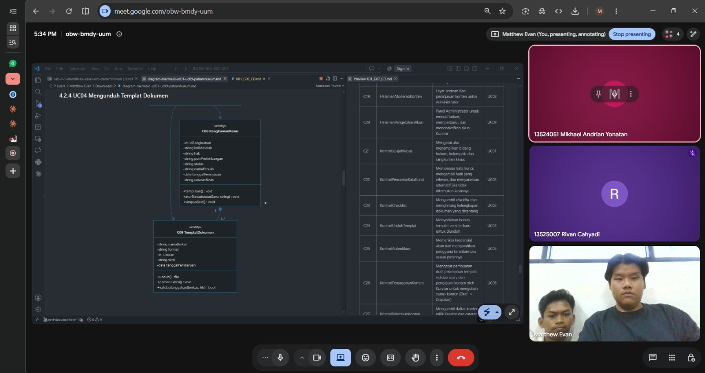

# Form Asistensi

## Tugas Besar IF2150 - Rekayasa Perangkat Lunak

| Informasi | Keterangan |
| --- | --- |
| **Hari** | Selasa |
| **Tanggal** | 22 September 2026 |
| **class** | K01 |
| **Nomor Kelompok** | 7  |
| **Nama Kelompok** | #PenjagaNilai  |
| **Nama Perangkat Lunak** | PahamHukum |
| **Dokumen** | K01_G07_CD.md  |

### Anggota Kelompok

| NIM | Nama |
| --- | --- |
| 13525064 | Matthew Evan Kurniawan |
| 13525019 | Raditya Wibian Sastaka |
| 13525007 | Rivan Cahyadi |
| 13525100 | Wesley Lianto |
| 13525109 | Christopherus Michael Jafeth Tobing |

### Catatan

| Catatan |
| --- |
| 1. Class diagram dibuat untuk mendefinisikan hubungan antarkelas yang dianalisis dari setiap use case. Class terdiri dari tiga jenis yaitu *entity* yaitu class yang berhubungan dengan *database*, *boundary* yaitu halaman dan antarmuka ke pengguna, dan *controller* yang menghubungkan *entity* dan *boundary* seperti API atau **services**. |
| 2. Aktor tidak perlu dimasukkan sebagai bagian dari class diagram. |
| 3. Atribut/Method yang **private** adalah fungsi yang terbatas aksesnya dalam class itu sendiri, sedangkan **public** bebas dipakai dan diakses class lain. |
| 4. Atribut class *boundary* adalah komponen tampilannya, seperti *button* atau *text field*. Boundary tidak mengambil data, tetapi controller mengirimkan perintah kepada entity untuk mengambil data sesuai id-nya. |
| 5. Pada UC04, adminTemplatDokumen perlu memiliki **reference** pada HalamanRangkumanKasus agar sistem bisa mencari templat sesuai dengan id yang berada pada HalamanRangkumanKasus. Relasi KontrolUnduhTemplat ke TemplatDokumen seharusnya dihapus karena kontrol mengambil data lewat RangkumanKasus. Relasi KontrolUnduhTemplat ke RangkumanKasus menjadi *dependensi* karena kontrol tidak menyimpan data secara permanen, hanya mengambil dan mengirimkannya. |
| 6. Pada UC09, perlu ada referensi dari Kurator ke Administrator untuk mengetahui Administrator mana yang menyetujui Kurator tersebut. Kalau referensi ini tidak diperlukan, class Administrator sebaiknya dihapus, karena class turunan hanya layak ada jika berbeda jauh dari Akun biasa. |

**Notes for this section:**  
*Catatan dapat dituliskan dalam bentuk paragraf atau poin-poin, disesuaikan saja.* 

## Dokumentasi

<!--  -->

  

  <i>Gambar 1. Dokumentasi kegiatan asistensi.</i>

## Catatan Evaluasi