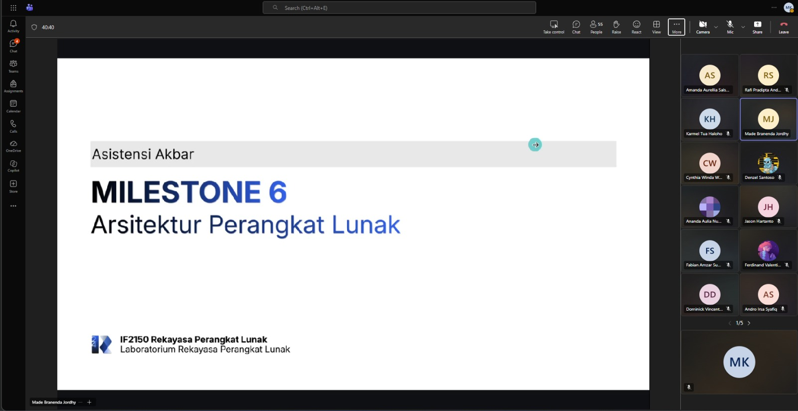

# Form Asistensi

## Tugas Besar IF2150 - Rekayasa Perangkat Lunak

| Informasi | Keterangan |
| --- | --- |
| **Hari** | Jumat |
| **Tanggal** | 2 Oktober 2026 |
| **Kelas** | K01 |
| **Nomor Kelompok** | 7  |
| **Nama Kelompok** | #PenjagaNilai |
| **Nama Perangkat Lunak** | PahamHukum |
| **Dokumen** | K01_G07_APL.md  |

### Anggota Kelompok

| NIM | Nama |
| --- | --- |
| 13525007 | Rivan Cahyadi |
| 13525019 | Raditya Wibian Sastaka |
| 13525064 | Matthew Evan Kurniawan |
| 13525100 | Wesley Lianto |
| 13525109 | Christopherus Michael Jafeth Tobing |

### Catatan

| Catatan |
| --- |
| 1. SKPL adalah baseline final. APL hanya menjelaskan rancangan untuk kebutuhan yang sudah ditetapkan, jadi tidak ada fitur atau kelas baru. Ketiga bab membahas satu desain yang sama. BAB 1 menentukan pattern, BAB 2 merinci komponennya, dan BAB 3 menggambar relasinya. |
| 2. Pattern dipilih dari kebutuhan. BAB 1 harus memuat peran tiap bagian pattern, alasan pemilihan yang dikaitkan dengan KF, KNF, dan jenis pengguna di SKPL, serta diagram penerapan yang sudah memakai nama komponen dan kelas P/L. Minimal satu pattern yang dipilih. Kelompok memilih MVC karena class diagram M4 sudah berpola boundary, control, entity, yang padanannya View, Controller, Model. |
| 3. Lingkungan operasi disalin dari SKPL subbab 2.5. Isinya tidak boleh diubah, lalu dijelaskan kaitan teknologinya dengan pattern. Contohnya peramban sebagai sisi View, server sebagai sisi Controller dan Model, dan DBMS sebagai penyimpan data. |
| 4. Tabel 2.1 menjadi acuan nama untuk seluruh dokumen. Kolomnya Nama, Jenis, dan Penjelasan. Kolom Jenis mengikuti pattern, dan Penjelasan menyebut tanggung jawab konkret komponen. Komponen tidak sama dengan kelas, jadi satu komponen boleh mewadahi beberapa kelas. Syaratnya semua kelas tercakup dan semua use case bisa dijalankan. Karena nama di tabel ini dipakai ulang di BAB 1 dan BAB 3, tabel ini dikerjakan dan dikunci paling awal. |
| 5. Jumlah view tidak bergantung pada jumlah pattern. Minimal satu view, dan tiap view menggambar seluruh sistem. View tambahan harus memberi sudut pandang berbeda, bukan mengulang. Kelompok memilih Logical View (pembagian layanan dan relasi komponen) dan Physical View (tempat komponen dijalankan, memakai deployment diagram) karena keduanya saling melengkapi. |

**Notes for this section:**  
*Catatan dapat dituliskan dalam bentuk paragraf atau poin-poin, disesuaikan saja.* 

## Dokumentasi

<!--  -->

  

  <i>Gambar 1. Dokumentasi kegiatan asistensi.</i>

